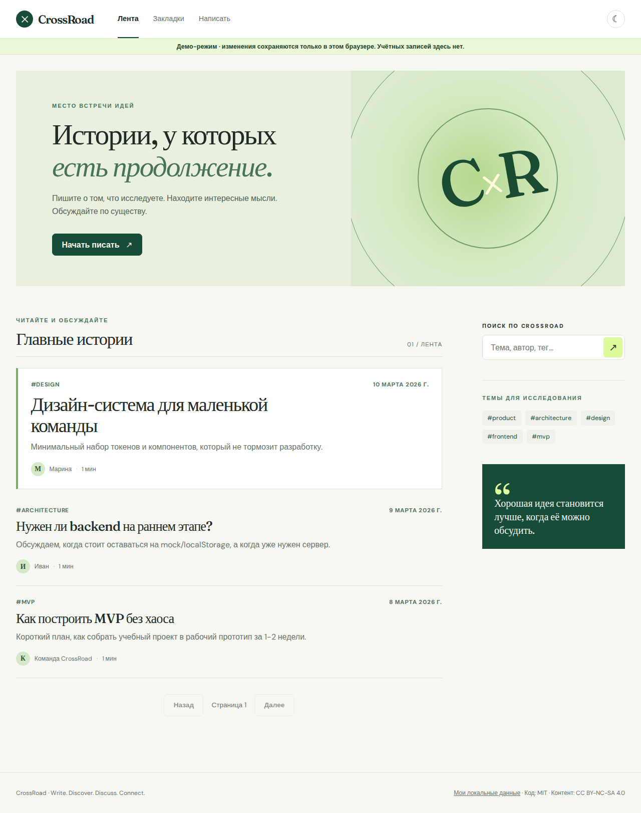

# CrossRoad

**Write. Discover. Discuss. Connect.** CrossRoad is an open-source space for publishing articles and discussing ideas. This repository now contains a working first fullstack slice and a separate static demo. It is an active rebuild, not a complete community platform.



[Mobile screenshot](docs/images/mobile.png)

## What works now

- Read published articles, search their text, authors and tags, comment, and save bookmarks.
- Register and sign in in fullstack mode. Passwords use scrypt; short-lived access JWTs are kept in browser memory. Rotating refresh tokens are hashed in PostgreSQL and sent only as HttpOnly cookies. Server checks ownership for drafts and comments.
- Create a draft, edit it with a version check, and publish it. The first editor stores plain text safely; rich text is on the roadmap.
- Run the same reader and writing flow as an **explicit browser-only demo** on GitHub Pages. Demo writes remain on the current device and are not accounts or server data.
- Export compatible `crossroad.posts.v2` records as JSON and raw demo data as text without deleting or uploading either key.

The larger product brief includes follows, communities, recommendations, moderation, notifications, rich text, profiles, and analytics. Those are **not implemented yet**; see the [prioritized roadmap](docs/product/ROADMAP.md).

## Stack and layout

| Area     | Current implementation                                                      |
| -------- | --------------------------------------------------------------------------- |
| Web      | React 18, TypeScript, Vite, React Router, TanStack Query, local font assets |
| API      | NestJS 11, REST, Zod validation, Swagger, Pino request logs                 |
| Data     | PostgreSQL, Prisma 6 migrations, full text index                            |
| Tests    | Vitest, isolated PostgreSQL integration runner, Playwright demo flow        |
| Delivery | pnpm workspace, Docker Compose files, GitHub Actions demo deployment        |

`apps/web` contains routes and both repository adapters; `apps/api` owns persistence and authorization; `packages/contracts` holds shared validation and response types. [Architecture](docs/architecture/OVERVIEW.md) explains the boundaries.

## Quick start: demo

Requires Node.js 22.12+ and pnpm 10.34.4.

```bash
pnpm install --frozen-lockfile
pnpm build:demo
pnpm --filter @crossroad/web preview
```

Open <http://localhost:4173>. During development, `pnpm dev` serves the demo at <http://localhost:5173> by default. The browser stores demo records under `crossroad.demo.v3`.

## Fullstack mode

1. Create `.env` from `.env.example`; set a random `SESSION_SECRET` of at least 32 bytes and a unique database password. Never commit `.env`.
2. Start PostgreSQL 16 and set `DATABASE_URL` for that instance.
3. Run:

```bash
pnpm install --frozen-lockfile
pnpm db:generate
pnpm db:migrate
pnpm build
pnpm dev:api
```

In another terminal, run `pnpm dev:api-web`. The root `.env` supplies the API URL and mode. The API is at <http://localhost:3000>; API docs are at `/docs`.

`docker compose up --build` is also configured for a local fullstack stack at <http://localhost:8080> after `.env` is set. Docker was unavailable in the audit environment, so this Compose path still needs an external smoke test. See [deployment notes](docs/engineering/DEPLOYMENT.md).

## Verification

```bash
pnpm lint
pnpm typecheck
pnpm test
pnpm test:integration
pnpm test:e2e
pnpm test:fullstack
pnpm build
pnpm check:budget
```

The integration command starts an isolated PostgreSQL instance, applies the migration, starts the compiled API, and exercises the main flow. The E2E command checks the static demo in Chromium. `test:fullstack` runs the API and browser together against isolated PostgreSQL. See [testing](docs/engineering/TESTING.md).

## Documentation and contribution

- [Audit and baseline](docs/engineering/AUDIT.md)
- [Development](docs/engineering/DEVELOPMENT.md)
- [Architecture decisions](docs/architecture/DECISIONS.md)
- [API reference](docs/api/README.md)
- [Roadmap](docs/product/ROADMAP.md)
- [Contributing](CONTRIBUTING.md), [security](SECURITY.md), [code of conduct](CODE_OF_CONDUCT.md)

Code retains its [MIT license](LICENSE). Existing sample content retains [CC-BY-NC-SA-4.0](CC-BY-NC-SA-4.0).
